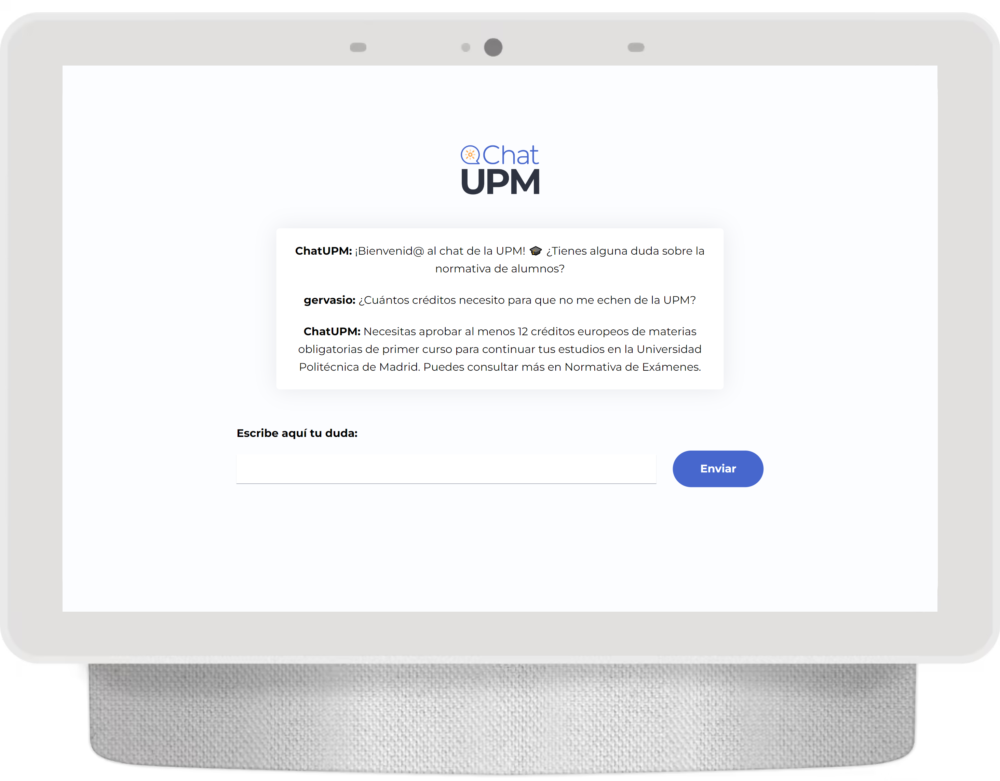
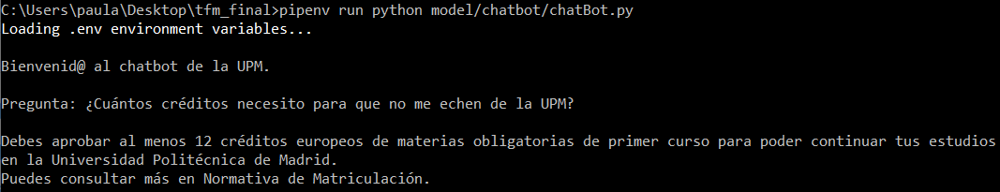

# ChatUPM

My Master's final thesis, a personalized chatbot versed in the Polytechnic University of Madrid's normative: ChatUPM. 

This project results in a custom chatbot assistant fueled by GPT models (``text-embedding-ada-002`` for embeddings and ``gpt-35-turbo`` for the chatbot answers), supported by a REST API built with Flask and deployed using Waitress. This virtual personal chatbot will assist for all things related to the student regulations at Universidad Politécnica de Madrid (UPM). With ChatUPM, you can get clear and precise answers to your questions and concerns regarding enrollment, deadlines, credits requirements, and more.\
Created to guide peers through the university journey!
<br/>
<br/>
<p align="center">  
  
</p>

## Project Structure
- ``app``: contains the files for the self-hosted fronted website.
  - ``instance`` folder with the SQLAlchemy database for users management.
  - ``static`` folder for the css and media files.
  - ``templates`` folder with the html files for the fronted page.
  - ``app.py``, the Flask app.
- ``data``: contains the pkl files for the scraped data (context pandas dataframe), after the preprocessing and the embeddings generation.
- ``demo``: how the app deployment should look like.
- ``model``: contains the files for the data scraping, the embeddings generation and the chatbot itself.
  - ``chatbot`` folder contains the chatbot implementation, given the context dataframe.
  - ``process`` folder contains the processing of the scraped data (both retrieval and embeddings), which can be run as standalone processes in ``scraping`` and ``embeddings`` classes.
- ``Pipfile`` and ``Pipfile.lock``: to manage dependencies using pipenv.
-  ``requirements.txt`` as an alternative to manage dependencies.
-  ``run.py`` to deploy the Flask app using Waitress.


## Installation
To use ChatUPM, you need to have Python installed on your machine. Follow these steps to get started:
> **Warning**
> Bear in mind that you need an API key for the use of the OpenAI models. This project was built with the [Azure OpenAI Service](https://learn.microsoft.com/en-us/azure/cognitive-services/openai/chatgpt-quickstart?tabs=command-line&pivots=programming-language-python) in mind, but can be adapted nonetheless.<br/>
1. Install pipenv if you haven't already:
```bash
$ pip instal pipenv
```
2. Clone the ChatUPM repository:
```bash
$ git clone https://github.com/paumurl/ChatUPM.git
```
3. Create a new virtual enviroment in the project folder:
```bash
$ pipenv shell
```
4. Install the necessary dependencies (listed in the Pipfile):
```bash
$ pipenv install
```
5. Run the ChatUPM application deployed using Waitress:
```bash
$ pipenv run python {your path}/run.py
```
This will launch the ChatUPM locally hosted website in localhost:5000.

The ``requirements.txt`` file is also provided as an alternative to the pipenv management.

## Usage
ChatUPM is designed to provide you with quick and accurate information about the student regulations at UPM. Simply start a conversation with the chatbot and ask your questions. It will understand and respond accordingly.

This project consisted of different functionalities:
- web scraping from [student regulations of the UPM](https://www.upm.es/Estudiantes/NormativaLegislacion/NormasEspecificas/Grado) to create a dataframe of pdf chunks, tracking the pdf origin of each text chunk. By default, to feed GPT models it's generally recommended to keep the input within a range of 2048 to 4096 tokens.
- generating embeddings, which are numeric representation vectors that capture semantic relationships and enable similarity search. You can read more [here](https://openai.com/blog/introducing-text-and-code-embeddings).
- the chatbot itself, served by a Flask REST API.


### Self-hosted web application
Once you have deployed the ChatUPM REST API (step 5 of the [Installation](#installation)), you can go to localhost:5000 to enjoy the web service. Here's an example of how to interact with ChatUPM through the fronted architecture:

<p align="center">
  
  
  
</p>  
<p align="center"> The homepage.</p>
</p>
<br/>

Just follow the steps, register and login to begin the ChatUPM experience.

<div class="container2">
  <p align="center">
    
  </p>
</div>
<br/>

And now, chat away! Have a go at ChatUPM and the knowledge it holds regarding the students' legislation.
<div class="container3">
  <p align="center">
    
  </p>
</div>


### Want to try modules?
As in any project, you can individually run different modules depending on your needs for funcionalities. To run the ChatUPM REST API, you need the embeddings dataframe. If this is the first time you run the project and are not using the data provided here, then you will need first to scrape the normative and generate the embeddings for the data chunks. This can be simply done by running the following command:
```
$ pipenv run python {your path}/model/processing/process.py
```
And that's it! You now have your dataframe, locally stored in the existing ``data`` folder.

If you wish, you may obtain obtain the scraping and embeddings separately! Simply instantiate the ``model/scraping/generalScraper`` class or ``model/embeddings/embedder`` class respectively with the appropiate methods. You can proceed in the same way with ``model/chatbot/chatBot`` class to obtain the ChatUPM responses through the terminal:

<p align="center">
    
 </p>


## Configuration
ChatUPM requires specific configuration. You should have your own keys and variables in the ``model/config.py`` file. You can also customize its behavior by modifying the GPT settings in the ``model/chatbot/chatbot.py`` file. Adjust the responses, add new rules, or improve the chatbot's capabilities according to your needs.

## License
This project is licensed under the GNU General Public License v3.0 (GPL-3.0).
You can find the full text of the license in the [LICENSE](LICENSE) file.

## Acknowledgments
Special mention goes to Víctor Robles Forcada and Álvaro García Barragán for their invaluable resources and guidance throughout the development of this project.

## Contact information
If you have any questions or feedback, feel free to reach out:

Email: paularobleslopez@gmail.com\
GitHub: paumurl


