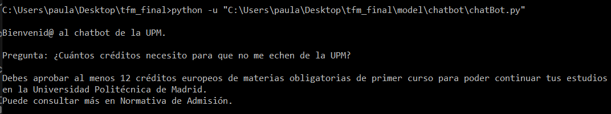
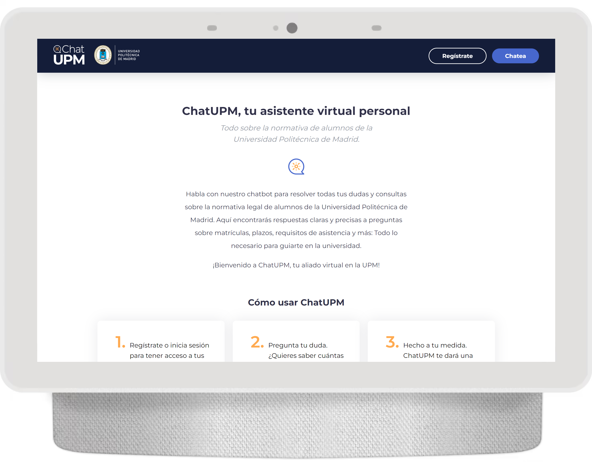
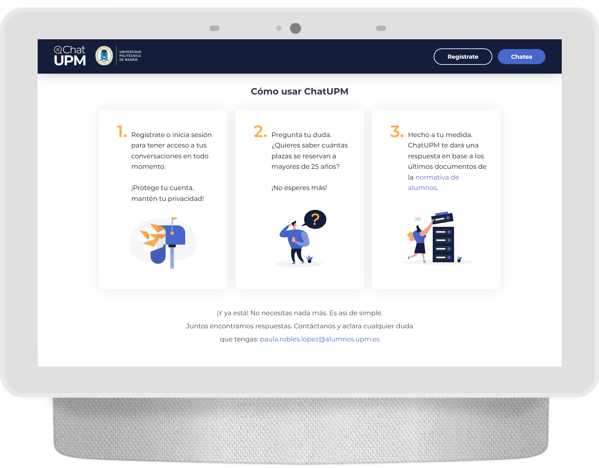
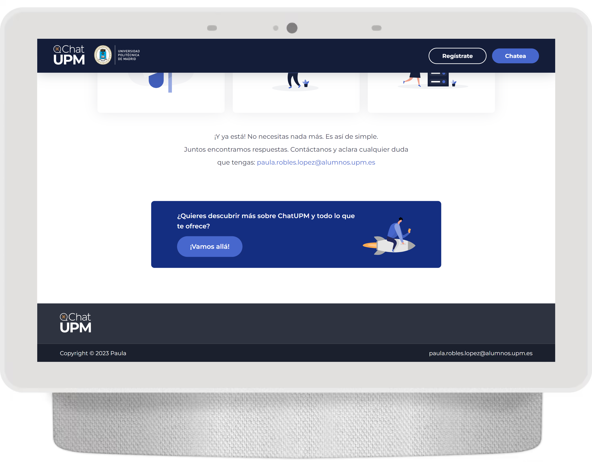
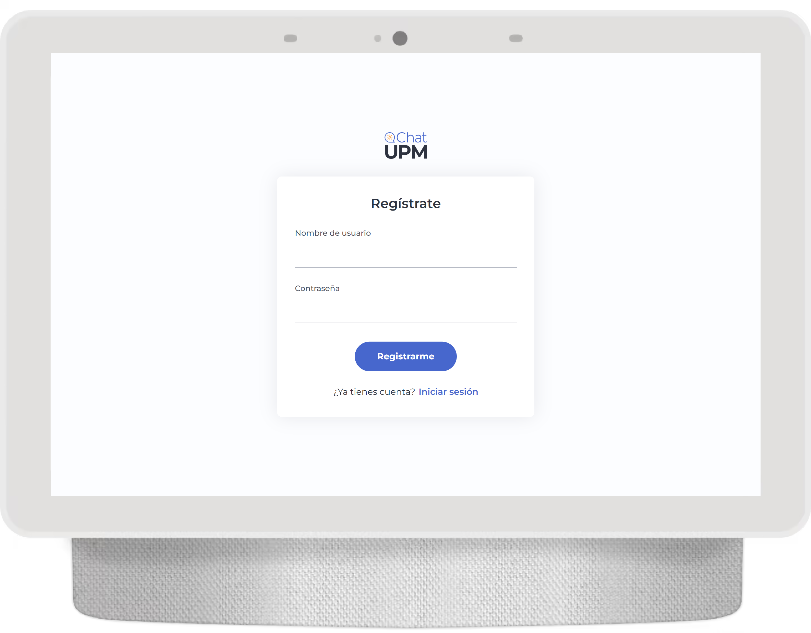

# [In progress] ChatUPM

My Master's final thesis, a personalized chatbot versed in the Polytechnic University of Madrid's normative: ChatUPM. 

This project will ultimately result in a custom chatbot assistant fueled by GPT models (``text-embedding-ada-002`` for embeddings and ``gpt-35-turbo`` for the chatbot answers), supported by a REST API built with Flask. This virtual personal chatbot will assist for all things related to the student regulations at Universidad Politécnica de Madrid (UPM). With ChatUPM, you can get clear and precise answers to your questions and concerns regarding enrollment, deadlines, credits requirements, and more.\
Created to guide peers through the university journey!
<br/>
<p align="center">  
  
</p>

## Installation
To use ChatUPM, you need to have Python installed on your machine. Follow these steps to get started:
> **Warning**
> Bear in mind that you need an API key for the use of the OpenAI models. This project was built with the [Azure OpenAI Service](https://learn.microsoft.com/en-us/azure/cognitive-services/openai/chatgpt-quickstart?tabs=command-line&pivots=programming-language-python) in mind, but can be adapted nonetheless.<br/>
1. Clone the ChatUPM repository:
```bash
git clone https://github.com/{your_username}/ChatUPM.git
```
2. Install the required dependencies:
```bash
pip instal -r requirements.txt
```
3. Run the ChatUPM application:
```bash
python app/app.py
```

This will launch the ChatUPM locally hosted website in localhost:5000.


## Usage
ChatUPM is designed to provide you with quick and accurate information about the student regulations at UPM. Simply start a conversation with the chatbot and ask your questions. It will understand and respond accordingly.

This project consisted of different functionalities:
- web scraping from [student regulations' of the UPM](https://www.upm.es/Estudiantes/NormativaLegislacion/NormasEspecificas/Grado) to create a dataframe of pdf chunks, tracking the pdf origin of each text chunk. By default, to feed GPT models, it's generally recommended to keep the input within a range of 2048 to 4096 tokens.
- generate embeddings, which are numeric representation vectors that capture semantic relationships and enable similarity search. You can read more [here](https://openai.com/blog/introducing-text-and-code-embeddings).
- the chatbot itself, served by a Flask REST API.

### First time: modules
As in any project, you can individually run different modules depending on your needs for funcionalities. To run ChatUPM REST API, you need the embeddings dataframe. If this is the first time you run the project and are not using the data provided here, then you will need first to scrape the normative and generate the embeddings for the data chunks. This can be simply done by following running:
```
python "model/processing/process.py"
```
And that's it! You now have your dataframe, locally stored in the existing ``data`` folder.

If you wish, you may obtain obtain the scraping and embeddings separately! Simply instantiate the ``model/scraping/generalScraper`` class or ``model/embeddings/embedder`` class respectively. You can proceed in the same way with ``model/chatbot/chatBot`` class to obtain the ChatUPM responses through the terminal:

<p align="center">
    
 </p>


### Fronted
Here's an example of how to interact with ChatUPM through the fronted architecture:

<div class="container" style="display:flex">
  
  
  
</div>
<p align="center">The homepage.</p>
<br/>

Just follow the steps, register and login to begin the ChatUPM experience:

<div class="container2">
  <p align="center">
    
  </p>
</div>


## Configuration
ChatUPM requires specific configuration. You should have your own keys and variables in the ``model/config.py`` file. You can also customize its behavior by modifying the settings in the ``model/chatbot.py`` file. Adjust the responses, add new rules, or improve the chatbot's capabilities according to your needs.

<!--
### License
This project is licensed under the MIT License.

## Acknowledgments
Special mention goes to Víctor Robles Forcada and Álvaro García Barragán for their invaluable resources and guidance throughout the development of this project.  -->

## Contact Information
If you have any questions or feedback, feel free to reach out:

Email: paularobleslopez@gmail.com\
GitHub: paumurl


