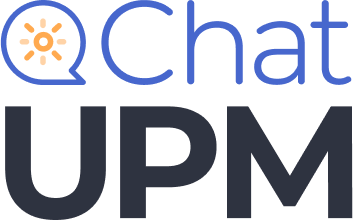

# [In progress] ChatUPM
  


My Master's final thesis, a personalized chatbot versed in the Polytechnic University of Madrid's normative: ChatUPM. 

This project will ultimately result in a custom chatbot assistant fueled by GPT models (``text-embedding-ada-002`` for embeddings and ``gpt-35-turbo`` for the chatbot answers), supported by a REST API built with Flask. This virtual personal chatbot will assist for all things related to the student regulations at Universidad Politécnica de Madrid (UPM). With ChatUPM, you can get clear and precise answers to your questions and concerns regarding enrollment, deadlines, credits requirements, and more.\
Created to guide peers through the university journey!
<br/>


## Installation
To use ChatUPM, you need to have Python installed on your machine. Follow these steps to get started:
> **Note**
> Bear in mind that you need an API key for the use of the OpenAI models. This project was built with the [Azure OpenAI Service](https://learn.microsoft.com/en-us/azure/cognitive-services/openai/chatgpt-quickstart?tabs=command-line&pivots=programming-language-python) in mind, but can be adapted nonetheless.<br/>
1. Clone the ChatUPM repository:
```bash
git clone https://github.com/{your_username}/ChatUPM.git
```
2. Install the required dependencies:
```bash
pip instal -r requirements.txt
```
3. Run the ChatUPM application:
```bash
python app/app.py
```

This will launch the ChatUPM locally hosted website in localhost:5000.


## Usage
ChatUPM is designed to provide you with quick and accurate information about the student regulations at UPM. Simply start a conversation with the chatbot and ask your questions. It will understand and respond accordingly.

Here's an example of how to interact with ChatUPM:
[Website](website.jpg)
